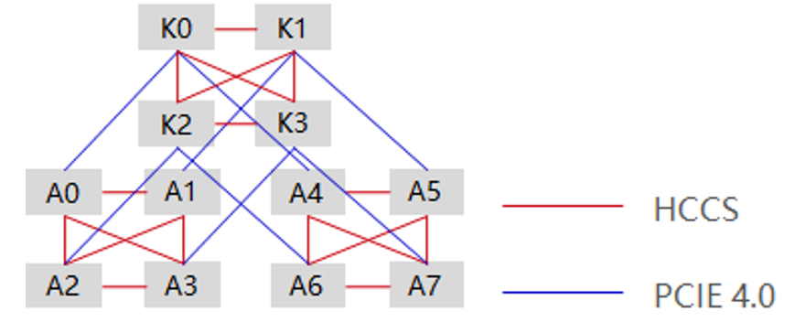

# Node Affinity K8s Scheduling Algorithm Design and Plugin Development Guide

## Affinity Policy Description

### Ascend 910 Chip Affinity Rules

The Ascend 910 chip is a high-performance AI chip developed by Huawei. The internal chips are connected in HCCS mode. Each physical device has eight chips and two HCCS rings. Each HCCS ring has four chips. The chips in the same ring can perform gradient switching, and chips in different HCCS rings cannot communicate with each other. That is, the chips allocated to the same pod (if the number of chips is less than or equal to 4) must be in the same HCCS ring. Otherwise, the job fails to be executed. Figure 1 shows the interconnection topology of Ascend 910 chips.



Figure 1 Ascend 910 chip interconnection topology

Note: A0?A7 in the figure are Ascend 910 chips, which are also called NPU chips, D chips, and 1980 chips.

### Affinity Policy Description

Based on the characteristics and resource utilization rules of the Ascend 910 chip, the affinity policies are formulated as follows:

| Priority | Policy Name                              | Description                                                  |
| :------- | :--------------------------------------- | :----------------------------------------------------------- |
| 1        | HCCS affinity scheduling                 | If the number of applied  chips is 1, the optimal choice is the remaining one chip in the same HCCS  ring, and the less optimal choices are three chips, two chips, and then four  chips.  If the number of applied  chips is 2, the optimal choice is the remaining two chips in the same HCCS  ring, and the less optimal choices are four chips and then three chips.  If the number of applied  chips is 4, the remaining four chips in the same HCCS ring must be selected.  If the number of applied  chips is 8, all the eight D chips must be selected. |
| 2        | Faulty chip exclusion and  compatibility | If the capacity of a node  with a faulty chip is less than 8, the node is stilled preferentially  scheduled. However, the priority of this node must be lowered. That is, the  node with the current priority can be selected only when there is no node  with the higher priority. |
| 3        | Full priority scheduling                 | AI servers that have been  allocated with Ascend 910 chips are preferentially scheduled to reduce  fragments.  To apply for one chip,  select a node whose capacity is 8, and select the remaining one chip in an  HCCS ring, and then one of the remaining three, two, and four chips.  To apply for two chips,  select a node whose capacity is 8, and select the remaining two chips in an  HCCS ring, and then two of the remaining four and three chips.  To apply for four chips,  select a node whose capacity is 8 and that has four remaining chips.  To apply for eight chips,  select a node whose capacity is 8 and that has no chip used. |
| 4        | Even number priority scheduling          | If 1 to 3 are met, an HCCS  ring with an even number of chips is preferred. |
| -        | Multi-node support                       | Only the 8 x N allocation  mode is supported for a training job. |

### Resource Application Constraints

Based on the service model design, the training job requirements are as follows:
1. If the number of chips applied for by a training job is less than or equal to 4, the required chips need to be scheduled in the same HCCS ring.
2. If the number of chips applied for by a training job is 8, the chips of the entire node need to be allocated to the job.
3. If the number of NPUs to be applied for is greater than 8, the number of NPUs to be applied for must be 8 x N (N ¡Ý 1).
4. If the number of chips applied for by a training job is less than or equal to 8, only one pod can be applied for. If the number is greater than 8, each pod has eight chips.

## Scheduling Algorithm Design

### Scenario Classification

Based on the affinity policies and service model design, the following scenarios are provided:

| **No.** | **Number of Chips Required by a Job** | **A**  **(Number of Remaining D Chips on a  Node)** | **B**                                                        | **C**     | **D**                                                        |                                                              |
| ------- | ------------------------------------- | --------------------------------------------------- | ------------------------------------------------------------ | --------- | ------------------------------------------------------------ | ------------------------------------------------------------ |
| 1       | 1                                     | 1~[0,1,2,3,4]                                       | 3~[0,2,3,4]                                                  | 2~[0,2,4] | 4~[0,4]                                                      | Set a node whose capacity to 7. A bad chip is regarded as used.  Repeat from A to D. |
| 2       | 2                                     | 2~[0,1,2,3,4]                                       | 4~[0,1,3,4]                                                  | 3~[0,1]   | Set a node whose capacity to 7. A bad chip is regarded as used.  Repeat from A to D. |                                                              |
| 3       | 4                                     | 4~[0,1,2,3,4]                                       | Set a node whose capacity to 7. A bad chip is regarded as used.  Repeat from A to D. |           |                                                              |                                                              |
| 4       | 8                                     | 8                                                   |                                                              |           |                                                              |                                                              |
| 5       | 8*N                                   | 0 (All the eight chips are used.)                   |                                                              |           |                                                              |                                                              |

Notes:

1. The four groups from A to D indicate the four HCCL scenarios that meet the chip selection requirements. Their priorities decrease in descending order. That is, if A does not meet the requirement, B, C, and then D are selected.
2. Node status in the group when the HCCS ring is met. The left part of ~ indicates the HCCS ring that meets the requirements, and the right part indicates the number of remaining chips in another HCCS ring. For example, for group A that applies for one chip, the other HCCS ring may have 0, 1, 2, 3, or 4 remaining chips. The priority of the node decreases accordingly.
3. To apply for eight or more chips, refer to the scenarios when four or fewer chips are applied for. However, all the chips are in group A and need to be used.

### Algorithm Design Description


Figure 2 Affinity algorithm design process

The process is as follows:
1. Obtain the number of Ascend 910 chips applied for a task.
2. The optimal node is selected based on the number of applied chips and resource application constraints.
3. Select chips that meet the requirements from the selected node.
4. Save the selection result.
5. Add points to the selected node. The preceding steps are implemented in the registration function **batchNodeOrderFn** provided by Volcano.
6. Allocate and manage resources of the selected node. This step is implemented in the **AddEventHandler** function of Volcano. This function contains the **allocate** function for pre-allocating node resources.
7. After the preceding operations are complete, the Volcano framework submits the allocation result to the API Server of Kubernetes for confirmation. The allocation is complete.

### Fault Considerations

The chip fault scenario design covers two steps: initializing four priority groups and selecting nodes.
Initializing four priority groups: Add the **available** field to the element structure design of the groups. This field indicates the number of available chips on a node. During subsequent group selection, the group with more healthy chips is preferentially selected based on this field.
Selecting nodes: Eight (normal) nodes are selected first based on the value of the **available** field. If no node is selected from the four groups, the node whose capability is 7 is considered, and then the node with lower capability in sequence.

### Multi-Node Considerations

This feature is designed based on the Volcano cluster. You only need to use the framework to score each node and select the optimal node.
Two-stage selection: Four preferred groups are selected and then nodes are selected in a group, which reflects the principle and implements the overall consideration of multiple nodes.

### Concurrency Considerations

Volcano does not provide the function callback method in the add method in the allocation phase. Therefore, chips are selected in the node filtering phase. In this way, when jobs are concurrently executed, the chips may be repeatedly allocated. This problem involves the following two scenarios:
1. Between tasks in a session: When multiple tasks need to be assigned at the same time and multiple tasks can be assigned to a node, the native Volcano only allocates the quantity but does not allocate chip IDs. As a result, the total number of chips is allocated, but a chip may be allocated for multiple times.
This program uses the AddEventHandler function provided by the Volcano framework to resolve the problem. In the **allocate** method of the function, the chip allocation of nodes can be controlled to prevent repeated allocation.
2. Between different sessions: When a chip is allocated to a session in the scoring phase, if the resource is in the waiting-to-release state, the chip cannot be allocated temporarily. As a result, the allocation fails, but Volcano cannot detect the failure in the current session. In the next session, the chip becomes available and will be allocated to another task. In this case, two tasks are allocated to the same chip, and one of the tasks fails.
One method for resolving the problem is to determine whether a resource is in a to-be-released state during the chip allocation in the scoring phase, and if yes, no allocation is performed this time.

## Scheduling Algorithm Implementation

### Process Design


Figure 3 Affinity process (Volcano)

Some affinity plugins are developed by using some major functions in the Volcano-schedule framework. When Volcano runs each session, the implemented function runs according to the compiled rule, implementing affinity scheduling of chips. The affinity scheduling plugin implements the following functions:

1. **validJobFn**:

This function is used to intercept jobs that apply for NPU resources. However, the number of applications must meet the resource application constraints. For details, see "Resource Application Constraints."

2. **AddPredicateFn**:

This function is used to filter out nodes that do not meet affinity requirements. For example, if the task applies for two chips, but each of the two HCCSs on the node has one chip, the node meets the quantity requirement but does not meet the affinity requirement. Therefore, the node needs to be excluded.

3. **AddBatchNodeOrderFn**:

This function is used to select nodes whose chips meet the affinity requirement, and put the result into a pod.

4. **AddEventHandler**:

This function is used to manage the available Ascend 910 chips of a node in a unified manner. This prevents incorrect allocation in the case of concurrent operations.

 

 

### Affinity Plugin Deployment

1. Register the affinity plugin in the framework.

Add the following information to the **volcano.sh/volcano/pkg/scheduler/plugins/factory.go** file:

```go
framework.RegisterPluginBuilder(topology910.PluginName, topology910.New)
```


2. Modify the deployment configuration file.

Add the following information to the **volcano.sh/volcano/installer/volcano-development.yaml** file:

```yaml
apiVersion: v1
kind: ConfigMap
metadata: 
  name: volcano-scheduler-configmap
  namespace: volcano-system
data: 
  volcano-scheduler.conf: |
   actions: "enqueue, allocate, backfill"
   tiers: 
   - plugins: 
     - name: priority
     - name: gang
     - name: conformance
     - name: topology910
```

Add the following information to the **volcano/installer/helm/chart/volcano/config/volcano-scheduler.conf** and **volcano-scheduler-ci.conf** files:

```yaml
tiers: 
- plugins: 
  - name: priority
  - name: gang
  - name: conformance
  - name: topology910
- plugins:
  - name: drf
  - name: predicates
  - name: proportion
  - name: nodeorder
  - name: binpack
```

3. Modify the default configuration of the program.

volcano.sh/volcano/pkg/scheduler/util.go

```yaml
var defaultSchedulerConf = `
 actions: "enqueue, allocate, backfill"
 tiers: 
 - plugins: 
   - name: priority
   - name: gang
   - name: topology910
- plugins:
  - name: drf
  - name: predicates
  - name: proportion
  - name: nodeorder
 `
```